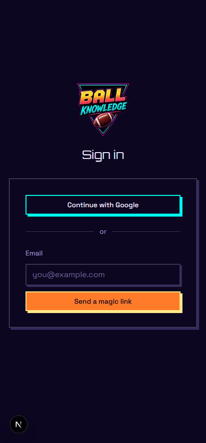
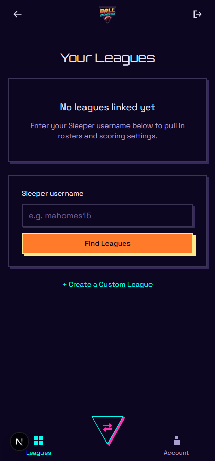
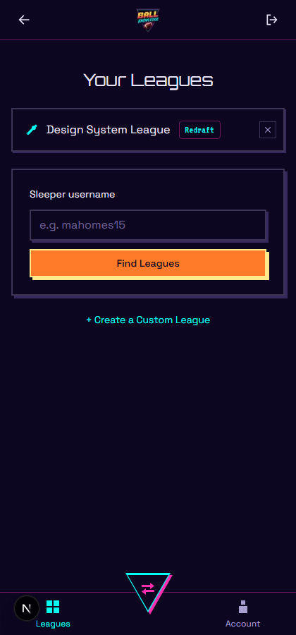
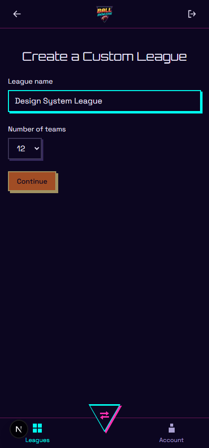
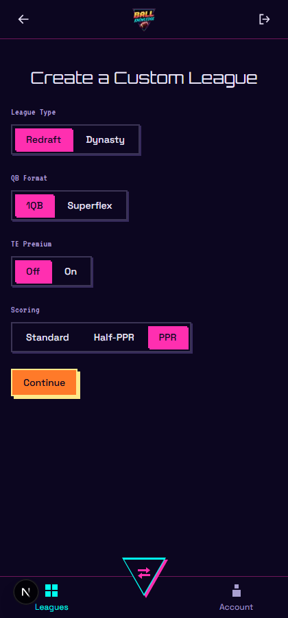
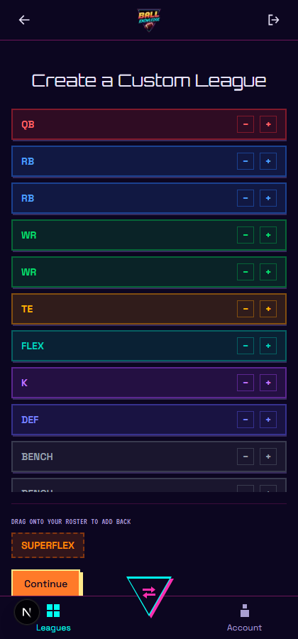
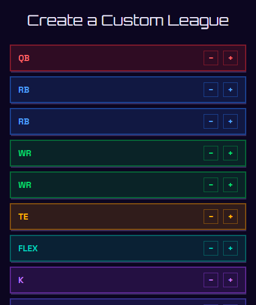
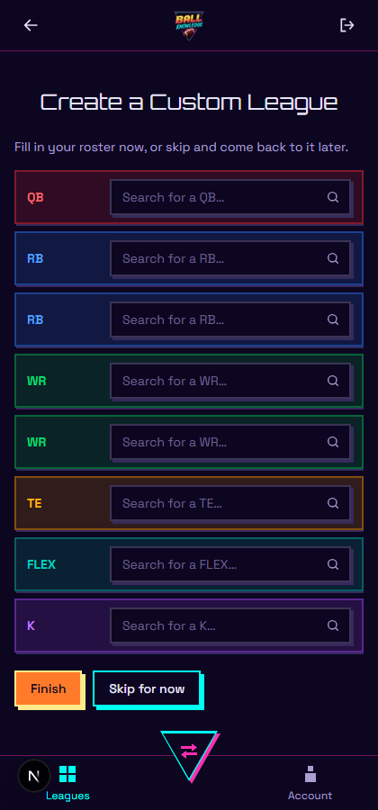
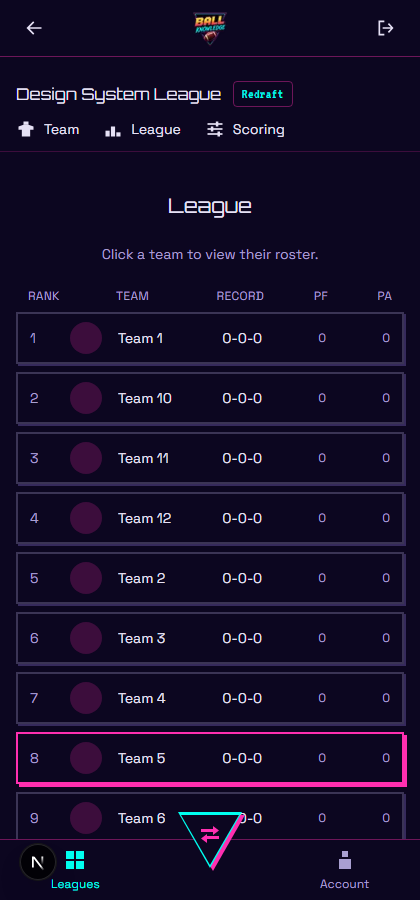

# Ball Knowledge — Design System

This document is the source of truth for the app's visual language: colors, type,
shape, and the state rules that govern shadows and borders. It exists so agents
(and humans) building new UI can match the existing system instead of
reinventing it per-component. If you're adding a new surface — a card, a
button, an input, anything with a border — read the **State rules** section
before writing className strings.

The look is a "neon cabinet" arcade aesthetic: hard 90° corners, offset
box-shadows instead of blur, and a small, disciplined set of accent colors
where *color choice itself carries meaning* (see [Color semantics](#color-semantics)).

Dark mode is the primary, designed-for mode (see the comment at the top of
`src/app/globals.css`). Light mode is supported and must stay legible, but the
dark palette is the one every new color decision should be checked against
first.

## Typography

Three typefaces, each with one job. Don't introduce a fourth without updating
this doc.

| Font | Loaded as | Tailwind class | Used for |
|---|---|---|---|
| **Orbitron** | `--font-orbitron` → `--font-display` | `font-display` | Headings (`h1`/`h2`), team names, league names — anything that's a title. |
| **VT323** | `--font-vt323` → `--font-accent` | `font-accent` | Small uppercase labels/eyebrows (e.g. toggle-group labels, roster-tray captions). A pixel font — keep it to short, large-enough text; it gets mushy below ~12px on real devices. |
| **Space Grotesk** | `--font-space-grotesk` → `--font-sans` | (default, set on `<body>`) | Everything else: body copy, form labels, button text, list rows. |

All three are wired up in `src/app/layout.tsx` via `next/font/google` and
exposed as CSS custom properties, then mapped to Tailwind utilities in the
`@theme inline` block of `globals.css`. Don't reference the Google Font names
directly in a component — always go through `font-display` / `font-accent` /
default body text.

## Color tokens

Defined once in `src/app/globals.css` as CSS custom properties on `:root`,
overridden under `@media (prefers-color-scheme: light)`, then re-exposed to
Tailwind via `@theme inline` (so `bg-card-border`, `text-secondary-accent`,
etc. all work as ordinary utility classes).

| Token | Dark value | Light value | Role |
|---|---|---|---|
| `--color-background` | `#0c0620` | `#f5f1ff` | Page background. |
| `--color-card-border` | `#ff2fb0` (magenta) | `#d6157e` | **Action/engagement accent** — hover, selection, "you did something." |
| `--color-secondary-accent` | `#00fff0` (cyan) | `#067a72` | **Focus accent** — "you're typing/interacting with this input right now." Also used as the Button secondary-variant color. |
| `--color-gold-accent` | `#ffe98a` | `#b8860b` | Primary-button border/shadow; warm accent generally. |
| `--color-orange-accent` | `#ff7a29` | `#b5480a` | Primary-button fill; warm accent generally. |
| `--color-body-text` | `#e6e1f5` | `#1a1030` | Default text color (set on `<body>`). |
| `--color-muted-text` | `#a99fd1` | `#5c4f80` | Secondary text, and — at low opacity (`/30`) — the **quiet rest-state border** for every static box. |
| `--color-neutral-shadow` | `#362a5c` | `#cabfe3` | The **quiet rest-state shadow** for every static box (see State rules). |

Gold and orange were pulled from the logo's own gradient (`public/logo/*.png`)
rather than picked freehand — check the logo file before introducing a new
warm accent.

### Color semantics

Color choice is not decorative here — each accent has exactly one job, and
mixing jobs is the single most common way this system goes wrong (see
"Lessons learned" below):

- **Pink (`--color-card-border`)** = hover / selected / "this is now chosen."
  Used for: card hover, selected team/league card, selected trade player,
  icon-button hover.
- **Cyan (`--color-secondary-accent`)** = focus / "you're actively typing
  here." Used for: input focus rings, the secondary Button variant, active
  bottom-nav tab.
- **Gold + orange** = the primary Button only (plus the FAB triangle's icon
  gold/orange is *not* used — the FAB is pink/cyan, see below). Don't reuse
  gold/orange as a hover or focus signal; they mean "primary action," full stop.
- **Neutral (`--color-muted-text`/30 border + `--color-neutral-shadow`)** =
  the rest state of every static box. It's deliberately quiet so the
  pink/cyan engagement colors actually pop when they appear.
- **Position colors** (red/blue/green/amber/purple/indigo/teal/orange/gray,
  see `src/lib/design/positionColors.ts`) = a *separate*, orthogonal color
  system for QB/RB/WR/TE/K/DEF/FLEX/SUPERFLEX/BENCH. Never let a pink/cyan
  engagement state override a position color — intensify *within* the
  position's own hue instead (see `hoverShadow`/`hoverAccent` below).

## Shape & shadow system ("Structural Depth")

Every bordered surface in the app follows the same three rules:

1. **90° corners, always.** `rounded-none` on every button, input, card, and
   row. No exceptions for "just this one card" — avatars, loading spinners,
   and small circular icon-only nav buttons are the only things allowed to
   stay round, because they're photographic/iconographic, not structural
   boxes.
2. **Hard, non-blurred offset shadows**, never `blur`/`shadow-lg`/glow. The
   pattern is always `shadow-[Npx_Npx_0_0_<color>]` — a flat color block
   offset down-and-right, no blur radius. `N` is typically `2px`–`4px`
   depending on the element's size (small icon buttons use `2px`, cards and
   panels use `3px`–`4px`).
3. **Shadow color encodes state**, not decoration. This is the part that's
   easy to get wrong — see the table below.

### State rules

| Surface type | Rest | Hover | Focus | Selected |
|---|---|---|---|---|
| **Button** (primary) | `border-gold-accent` + gold shadow, always on | shrinks toward the shadow (`translate` + smaller offset) | — | — |
| **Button** (secondary) | `border-secondary-accent` + cyan shadow, always on | same shrink | — | — |
| **Static box** (panel, standings row, dashboard card, toggle track, empty state) | `border-muted-text/30` + `shadow-*-neutral-shadow` | if clickable: border/shadow → pink | n/a | pink border/shadow, persistent |
| **Input / select** | `border-muted-text/30` + neutral shadow | n/a | border/shadow → cyan | n/a |
| **Square icon-button** (×, +/-) | quiet border in its "identity color" (see below), no fill | border + shadow fill to that identity color; **background never fills**, only border/shadow/text change | n/a | n/a |
| **Position-tinted card** (trade player select) | position's own translucent bg/border + neutral shadow | shadow intensifies to that *same* position's solid color (not pink) | n/a | pink border/shadow, persistent, overriding the position border |

The "square icon-button" identity color is pink by default (`IconButton`,
used for delete/close), or the row's own position color when the button
lives inside a position-tinted row (`RosterConstructionStep`'s +/− controls).
Never go back to a fixed, unrelated color pair (the old pink-add/cyan-remove
scheme) — see Lessons learned.

## Components

### `Button` (`src/components/ui/Button.tsx`)

Two variants, both always-shadowed (buttons are the one surface exempt from
the "shadow means state" rule — they're shadowed unconditionally):

- **primary** — `bg-orange-accent`, `border-gold-accent`, gold hard shadow.
  The one and only "primary action" surface in the app.
- **secondary** — transparent fill, `border-secondary-accent`, cyan hard
  shadow.

Both "press" on hover: translate 2px toward the shadow and shrink the offset
from 4px to 2px, simulating a physical button push.

### `IconButton` (`src/components/ui/IconButton.tsx`)

The standard for every small icon-only action button (delete, close, dismiss).
Rest state is a quiet 24×24 square with a `border-muted-text/30` outline and
muted-text icon color — no fill, no shadow. On hover, **only the border,
icon color, and shadow shift to pink** — the background never fills. This was
a deliberate correction (see Lessons learned): an earlier version filled pink
on hover and it read as too heavy for a small inline control.

**Always use an "×" icon (`CloseIcon`), never the word "Close"/"Cancel" as a
button label.** This was an explicit standing rule from the design review —
apply it to any new dismiss/remove action.

### Roster construction +/− buttons (`RosterConstructionStep.tsx`)

Same square-icon-button geometry as `IconButton`, but the "identity color" is
the row's own position color (via `getPositionColorClasses(slot).hoverAccent`)
instead of a fixed pink. Quiet outline at rest, solid position-color fill +
shadow on hover. This replaced an earlier version that used a fixed
pink-remove / cyan-add pair — see Lessons learned for why that was rejected.

### Trade player select cards (`PlayerSelectCard.tsx`)

Rest state keeps each player's position-tinted background/border (from
`getPositionColorClasses`) plus the standard neutral rest shadow. Hovering
intensifies the shadow to *that same position's* solid color
(`colors.hoverShadow`) rather than a generic pink — hovering a QB card glows
red, not pink, so the position identity never gets washed out. Selecting a
card overrides the frame to pink border + pink shadow, persistent — pink
always means "this is chosen," regardless of what color the card was at rest.

### Trade FAB (`BottomNavBar.tsx`)

The one place shape breaks from squares: an apex-down triangle, matching the
triangle the app's own logo sits inside (`public/logo/*.png`). Built from
three stacked, absolutely-positioned layers inside the nav `Link` (since a
`box-shadow` can't ride along a `clip-path` shape the way it can a normal
rectangular box):

1. A pink layer, offset by `translate(3px, 3px)` — the "shadow."
2. A cyan layer, same size, no offset — the "border"/stroke.
3. A background-colored layer, inset by 3px — the "fill," which leaves a
   ~3px ring of the cyan layer visible around the edge.
4. The `TradeIcon`, colored pink, centered on top (nudged down with
   `padding-bottom` since a downward triangle's visual center of mass sits
   above its geometric center).

Final color decision, after two rounds of exploration: **cyan border, pink
shadow, pink icon.**

## Applying this to a new component

1. Corners: `rounded-none`. No exceptions unless it's a photo/avatar or a
   universally-round convention (loading spinner).
2. Pick a surface type from the State rules table above and copy its
   rest/hover/focus pattern — don't invent a new shadow color pairing.
3. If it's a small icon-only action button, use `IconButton` directly, or
   match its geometry (24×24, 1px border, no-fill hover) if it needs a custom
   "identity color."
4. If it needs a "this is chosen" state, that's pink, persistent, and
   overrides whatever else was going on with the border.
5. Never pair two saturated accent colors (e.g. pink border + cyan shadow, or
   pink + gold) directly against each other on the same static element — see
   Lessons learned.
6. Take a real screenshot (dark mode) before calling it done. Class names
   that look right in isolation can still clash once rendered — verify, don't
   assume.

## Lessons learned (why the rules are what they are)

These aren't arbitrary — each one was a specific correction during the design
review that produced this system:

- **Two saturated neons directly adjacent read as "hard on the eyes."** An
  early pass paired a magenta border with a cyan shadow on every card/input.
  It was visually loud and caused a simultaneous-contrast "vibration" effect.
  Fixed by making rest-state shadows monotone/neutral and reserving
  pink/cyan for genuine state changes (hover/focus/selected), not decoration.
- **Color pairings should come from the actual logo, not be guessed.** The
  logo pairs magenta directly with cyan (outline vs. fill) and gold directly
  with orange (its own text gradient) — but gold never touches magenta in the
  logo. The Button primary variant went through gold-fill/magenta-shadow →
  gold-fill/orange-shadow → orange-fill/gold-shadow before landing on the
  final pairing, each time checked against the source logo file.
  **Look before you assume:** the logo is at
  `public/logo/ball-knowledge-logo-256x256.png` — read it before inventing a
  new color pairing.
- **A fixed pink/cyan pair on the roster +/− buttons looked like "a sore
  thumb."** Two loud, unrelated accent colors sitting on top of an otherwise
  quiet, position-tinted row didn't feel like part of the row. Fixed by
  making the buttons borrow the row's own position color instead of a
  universal pair — this became the general "square icon-button" pattern,
  later reused for delete/close buttons app-wide.
- **Icon-button hover shouldn't fill the background.** The first version of
  the shared icon-button filled solid pink on hover; that read as too heavy
  for a small inline delete/close control. Corrected to: border, icon color,
  and shadow shift to pink — background stays exactly as it was.
- **Shapes were explored iteratively for the Trade FAB**, from a plain circle
  with a soft glow → square / squircle / diamond (matching the corner
  language literally) → a gradient beacon / notched tab / outline orb / hex
  badge (varying color pairings) → finally a triangle, because it's the
  actual shape the logo's own mark sits inside, which reads as more
  intentional than any of the geometric-primitive options.
- **Buttons (and only buttons) are always shadowed**, unlike every other
  surface where shadow = state. This is intentional: a button's whole job is
  to look pressable at every moment, not just on hover.

## Screenshots

All captured live from the running app, dark mode, mobile viewport (420×900).

### Sign-in

### Dashboard — empty state

### Dashboard — with a synced/created league

### Create Custom League — league details (step 1)

### Create Custom League — scoring & format toggles (step 2)

### Create Custom League — roster construction (step 3)

Close-up on the position-colored rows and their quiet +/− buttons:

### Create Custom League — fill in your own roster (step 4)

### League standings

(Row 8 is mid-hover in this capture — a good look at the pink hover state on
an otherwise quiet, neutral-shadowed row.)

## Known follow-ups (not yet done)

- `AppHeaderBar`'s back/logout buttons and avatar circles are intentionally
  left `rounded-full` — not addressed by this pass, and not clearly in scope
  (icon-only header buttons and photographic avatars are a reasonable
  exception to the 90°-corners rule, but this was never explicitly discussed
  with the user).
- The `ToggleGroup` non-selected pill still has a subtle `hover:text-secondary-accent`
  text-color hint left over from before this pass — very minor, but not
  strictly consistent with "cyan = focus only."
